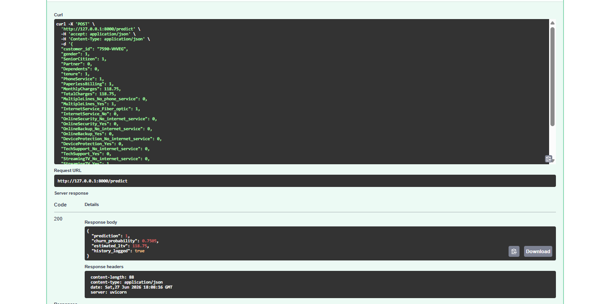

# Customer Churn Prediction & Lifetime Value (LTV) System

## Overview

This project is a **production-level data analytics and machine learning system** designed to predict customer churn, estimate Customer Lifetime Value (LTV), identify high-value customers at risk, and support customer retention decisions through an interactive business dashboard.

The system helps organizations:

* Identify customers at risk of churn
* Estimate customer lifetime value
* Segment customers into Low Value, Medium Value, and High Value groups
* Prioritize high-value customers for retention campaigns
* Analyze revenue risk caused by churn
* Support business teams with dashboard-ready insights

---

## Problem Statement

Customer churn directly affects revenue and growth in telecom and subscription-based businesses.

This project aims to:

* Predict the probability of customer churn
* Estimate long-term customer value using LTV modeling
* Identify high-value customers who are at churn risk
* Provide actionable insights through PostgreSQL analysis
* Build an interactive Metabase dashboard for business users
* Support data-driven customer retention and customer success strategies

---

## Current Project Status

The main project workflow has been completed.

### Completed

* Project repository setup
* Virtual environment setup
* Exploratory Data Analysis
* Data cleaning and preprocessing
* Missing value handling
* Data type correction
* PostgreSQL database setup
* pgAdmin setup
* PostgreSQL-Python integration
* Dataset upload to PostgreSQL
* Environment variable security using `.env`
* PostgreSQL query analysis
* Feature engineering
* Model preparation
* Train-test split
* Feature scaling
* Multi-model training and evaluation
* Final model selection
* Model persistence using Joblib
* Prediction pipeline
* SHAP model explainability
* FastAPI setup
* FastAPI prediction endpoint
* Swagger UI testing
* Customer Lifetime Value modeling
* LTV segmentation
* Customer priority matrix
* High-priority customer identification
* Customer_ID restoration
* PostgreSQL integration of LTV datasets
* PostgreSQL business analytics tables
* Metabase dashboard development
* Interactive LTV Segment dashboard filter
* Dashboard SQL query documentation
* Dashboard screenshots
* FastAPI prediction screenshot
* Final project documentation

### Optional Future Enhancements

* Dockerization
* Cloud deployment
* Automated model retraining
* CI/CD pipeline
* API monitoring
* Dashboard deployment on a shared server

---

## System Architecture

```text
Raw Dataset
    ↓
Data Cleaning & Preprocessing
    ↓
PostgreSQL Database
    ↓
Feature Engineering
    ↓
Model Preparation
    ↓
Machine Learning Model Training
    ↓
Model Evaluation & Selection
    ↓
Model Explainability using SHAP
    ↓
FastAPI Prediction API
    ↓
Customer Lifetime Value Modeling
    ↓
Customer Segmentation & Priority Matrix
    ↓
PostgreSQL Business Analytics Tables
    ↓
Metabase Dashboard Development
    ↓
Business Insights & Retention Strategy
```

---

## Tech Stack

### Programming Languages

* Python
* SQL

### Data Engineering & Storage

* PostgreSQL
* pgAdmin
* SQLAlchemy
* Psycopg2
* Python-dotenv

### Data Analysis & Machine Learning

* Pandas
* NumPy
* Scikit-learn
* Logistic Regression
* Random Forest
* XGBoost
* SHAP

### API Layer

* FastAPI
* Uvicorn
* Swagger UI

### Dashboard & Business Intelligence

* Metabase

### Version Control

* Git
* GitHub

---

## Dataset

The project uses the Telco Customer Churn dataset.

The dataset contains customer demographic information, account information, service subscriptions, charges, tenure, and churn status.

After cleaning, the final processed dataset contains:

* 7,032 customer records
* 21 cleaned columns
* Corrected `TotalCharges` data type
* Removed missing values
* No duplicate records

---

## Database Information

Database: PostgreSQL

Database Name:

```text
customer_churn_db
```

### Tables Used

| Table Name                | Purpose                                                                                          |
| ------------------------- | ------------------------------------------------------------------------------------------------ |
| `telco_customer_churn`    | Cleaned customer churn dataset stored in PostgreSQL                                              |
| `customer_churn_ltv`      | Final analytics table containing churn, LTV, customer segments, priority groups, and Customer_ID |
| `high_priority_customers` | Subset of High Value - High Risk customers for retention-focused analysis                        |

The PostgreSQL database stores cleaned data, final LTV-enhanced customer data, and high-priority customer segments. These tables support SQL analysis, dashboard development, and business reporting.

---

## Key Business Metrics

| Metric                          |        Value |
| ------------------------------- | -----------: |
| Total Customers                 |        7,032 |
| Churned Customers               |        1,869 |
| Non-Churned Customers           |        5,163 |
| Overall Churn Rate              |       26.58% |
| High Priority Customers         |          254 |
| Total High-Priority LTV at Risk | 1.41 Million |

---

## Formulas Used

This project uses business and analytics formulas to calculate churn, customer lifetime value, revenue risk, and customer segmentation metrics.

### 1. Estimated Customer Lifetime Value

```text
Estimated_LTV = MonthlyCharges × tenure
```

This formula estimates the total customer value based on monthly charges and customer tenure.

---

### 2. Overall Churn Rate

```text
Overall Churn Rate (%) = (Total Churned Customers / Total Customers) × 100
```

In SQL:

```sql
ROUND((SUM("Churn")::numeric / COUNT(*)) * 100, 2)
```

This formula calculates the percentage of customers who have churned.

---

### 3. Churn Rate by LTV Segment

```text
Segment Churn Rate (%) = (Churned Customers in Segment / Total Customers in Segment) × 100
```

In SQL:

```sql
ROUND((SUM("Churn")::numeric / COUNT(*)) * 100, 2)
```

This formula helps compare churn behavior across Low Value, Medium Value, and High Value customer segments.

---

### 4. Total LTV at Risk

```text
Total LTV at Risk = SUM(Estimated_LTV of High Value - High Risk Customers)
```

In SQL:

```sql
ROUND((SUM("Estimated_LTV") / 1000000.0)::numeric, 2)
```

This formula calculates the estimated customer value at risk among high-priority customers.

---

### 5. Churned LTV by Segment

```text
Churned LTV by Segment = SUM(Estimated_LTV where Churn = 1)
```

In SQL:

```sql
ROUND((SUM(CASE WHEN "Churn" = 1 THEN "Estimated_LTV" ELSE 0 END) / 1000000.0)::numeric, 2)
```

This formula calculates revenue exposure caused by churn within each LTV segment.

---

### 6. Average LTV

```text
Average LTV = SUM(Estimated_LTV) / Number of Customers
```

In SQL:

```sql
ROUND(AVG("Estimated_LTV")::numeric, 2)
```

This formula calculates the average customer lifetime value for each segment or customer priority group.

---

### 7. Customer Priority Matrix

```text
Customer Priority = LTV Segment + Churn Risk
```

Examples:

```text
High Value + Churn = High Value - High Risk
High Value + Not Churned = High Value - Low Risk
Medium Value + Churn = Medium Value - High Risk
Medium Value + Not Churned = Medium Value - Low Risk
Low Value + Churn = Low Value - High Risk
Low Value + Not Churned = Low Value - Low Risk
```

This logic helps identify which customers should be targeted first for retention campaigns.

---

## LTV Segmentation Summary

Customers were segmented into three LTV groups:

| LTV Segment  | Customer Count |
| ------------ | -------------: |
| Low Value    |          3,516 |
| Medium Value |          1,758 |
| High Value   |          1,758 |

### Churn Rate by LTV Segment

| LTV Segment  | Churn Rate |
| ------------ | ---------: |
| Low Value    |     34.41% |
| Medium Value |     23.04% |
| High Value   |     14.45% |

---

## Customer Priority Matrix Summary

A customer priority matrix was created by combining LTV segment and churn status.

| Customer Priority        | Count |
| ------------------------ | ----: |
| Low Value - Low Risk     | 2,306 |
| High Value - Low Risk    | 1,504 |
| Medium Value - Low Risk  | 1,353 |
| Low Value - High Risk    | 1,210 |
| Medium Value - High Risk |   405 |
| High Value - High Risk   |   254 |

The most important retention group is:

```text
High Value - High Risk
```

These customers have high estimated lifetime value and are at churn risk.

---

## Project Structure

```text
customer_churn_ltv_system/
├── api/
│   ├── main.py
│   ├── routes.py
│   ├── schemas.py
│   └── screenshots/
│       └── fastapi_prediction.png
├── dashboard/
│   ├── dashboard_sql_queries.py
│   ├── dashboard_sql_queries.md
│   ├── metabase_dashboard_progress.md
│   └── dashboard_screenshots/
│       ├── executive_overview.png
│       ├── executive_overview_high_value_filter.png
│       ├── executive_overview_medium_value_filter.png
│       ├── executive_overview_low_value_filter.png
│       ├── retention_action_insights.png
│       ├── retention_top_customers_to_retain.png
│       ├── highest_ltv_customers_at_risk.png
│       ├── retention_high_value_filter.png
│       ├── retention_medium_value_filter.png
│       └── retention_low_value_filter.png
├── data/
│   ├── raw/
│   │   └── Telco-Customer-Churn.csv
│   └── processed/
│       ├── cleaned_telco_data.csv
│       ├── feature_engineered_data.csv
│       ├── customer_churn_ltv_final.csv
│       └── high_priority_customers.csv
├── models/
│   └── saved_model/
│       └── logistic_regression_model.pkl
├── notebooks/
│   ├── eda.ipynb
│   ├── data_cleaning.ipynb
│   ├── feature_engineering.ipynb
│   ├── model_preparation.ipynb
│   ├── model_training.ipynb
│   ├── shap_analysis.ipynb
│   ├── ltv_modelling.ipynb
│   ├── ltv_postgresql_integration.ipynb
│   ├── ltv_postgresql_analysis.ipynb
│   └── customer_data_enrichment.ipynb
├── reports/
├── src/
│   ├── database/
│   │   └── connection.py
│   ├── preprocessing/
│   │   ├── clean_data.py
│   │   ├── featureengineering.py
│   │   └── ltv_calculator.py
│   ├── models/
│   │   ├── churn_predict.py
│   │   ├── ltv_predict.py
│   │   └── shap_analysis.py
│   └── utils/
│       └── config.py
├── requirements.txt
├── README.md
└── .gitignore
```

---

## Data Cleaning & Preprocessing

The raw dataset was cleaned before model training and analytics.

### Cleaning Steps

* Loaded raw Telco customer churn dataset
* Converted `TotalCharges` from object/string to numeric
* Handled missing values in `TotalCharges`
* Removed missing records
* Checked duplicate records
* Validated categorical values
* Reviewed numerical columns
* Exported cleaned dataset

Final cleaned dataset:

```text
data/processed/cleaned_telco_data.csv
```

---

## Feature Engineering

Feature engineering was performed to prepare the dataset for machine learning.

### Key Steps

* Encoded categorical variables
* Removed non-predictive customer identifier columns from model training
* Prepared model-ready features
* Created final feature-engineered dataset

Feature-engineered dataset:

```text
data/processed/feature_engineered_data.csv
```

---

## Machine Learning Modeling

Multiple models were trained and evaluated for churn prediction.

### Models Compared

* Logistic Regression
* Random Forest
* XGBoost

### Final Selected Model

```text
Logistic Regression
```

Logistic Regression was selected as the final model because it provided a strong balance of performance, interpretability, and suitability for churn prediction.

The trained model was saved using Joblib:

```text
models/saved_model/logistic_regression_model.pkl
```

---

## Model Explainability

SHAP was used for model explainability.

SHAP analysis helps understand:

* Which features influence churn prediction
* How different customer attributes affect churn probability
* Why the model predicts a customer as high-risk or low-risk

This improves transparency and makes the model more useful for business decision-making.

---

## FastAPI Prediction API

The churn prediction model is exposed using FastAPI.

To run the API locally:

```bash
uvicorn api.main:app --reload
```

Open Swagger UI:

```text
http://127.0.0.1:8000/docs
```

The API provides a prediction endpoint that returns:

* Churn prediction
* Churn probability

Example response:

```json
{
  "prediction": 1,
  "churn_probability": 1
}
```

### FastAPI Prediction Screenshot

The churn prediction API was tested successfully using Swagger UI.



---

## Customer Lifetime Value Modeling

The project includes Customer Lifetime Value modeling to estimate customer value and support retention-focused business decisions.

### LTV Formula

```text
Estimated_LTV = MonthlyCharges × tenure
```

Where:

* `MonthlyCharges` = monthly amount paid by customer
* `tenure` = customer duration in months

### LTV Statistics

| Metric      |    Value |
| ----------- | -------: |
| Count       |    7,032 |
| Mean LTV    | 2,283.15 |
| Median LTV  | 1,394.58 |
| Minimum LTV |    18.80 |
| Maximum LTV | 8,550.00 |

---

## Customer_ID Restoration

Customer_ID was removed during model training because it does not help the machine learning model predict churn.

However, Customer_ID was restored later for business analytics because customer-level identification is required for:

* Reporting
* Dashboards
* Retention actions
* Customer success follow-up
* High-priority customer tracking

---

## Metabase Dashboard

The project includes an interactive Metabase dashboard for churn, LTV, revenue risk, and customer retention analysis.

The dashboard contains two tabs.

### 1. Executive Overview

This tab shows high-level KPIs and charts:

* Total Customers
* Overall Churn Rate
* Total LTV at Risk
* High Priority Customers
* Churn vs Non-Churn Customers
* Churn Rate by LTV Segment
* Customer Distribution by LTV Segment
* LTV at Risk by Segment
* Revenue Value by Customer Priority

### 2. Retention Action & Customer Insights

This tab shows detailed retention tables:

* Retention Priority Summary
* Segment-wise Churn and Revenue Impact
* Top Customers to Retain
* Top 10 Highest LTV Customers at Risk

---

## Interactive LTV Segment Filter

An interactive dashboard filter was added in Metabase.

### Filter Details

| Setting              | Value                                |
| -------------------- | ------------------------------------ |
| Filter Name          | LTV Segment                          |
| Variable Name        | `ltv_segment`                        |
| Variable Type        | Field Filter                         |
| Field Mapping        | `customer_churn_ltv` → `LTV_Segment` |
| Filter Type          | Dropdown list                        |
| Selection Type       | Single value                         |
| Values               | Low Value, Medium Value, High Value  |
| Default Value        | Blank                                |
| Always Require Value | Off                                  |

### Filter-Enabled Cards

The LTV Segment filter is connected to selected dashboard cards:

* Overall Churn Rate
* Churn vs Non-Churn Customers
* Revenue Value by Customer Priority
* Retention Priority Summary
* Segment-wise Churn and Revenue Impact
* Top Customers to Retain
* Top 10 Highest LTV Customers at Risk

The filter allows users to analyze churn, revenue value, and retention insights separately for:

* Low Value customers
* Medium Value customers
* High Value customers

---

## Dashboard Preview

### Executive Overview


### Executive Overview with High Value Filter


### Executive Overview with Medium Value Filter


### Executive Overview with Low Value Filter


### Retention Action & Customer Insights


### Retention Top Customers to Retain


### Highest LTV Customers at Risk


### Retention Insights with High Value Filter


### Retention Insights with Medium Value Filter


### Retention Insights with Low Value Filter


---

## SQL Query Documentation

Dashboard SQL queries are documented in:

```text
dashboard/dashboard_sql_queries.md
```

Reusable dashboard SQL queries are stored in:

```text
dashboard/dashboard_sql_queries.py
```

These files include:

* KPI queries
* Churn analysis queries
* LTV segment queries
* Revenue risk queries
* Retention priority queries
* Customer-level retention queries
* LTV Segment filter-enabled queries

---

## Security

Sensitive credentials are stored using environment variables.

Files excluded from GitHub:

```text
.env
venv/
__pycache__/
*.pyc
```

Database passwords and local configuration files are never pushed to the repository.

---

## How to Run the Project Locally

### 1. Clone the Repository

```bash
git clone <your-repository-url>
cd customer_churn_ltv_system
```

### 2. Create Virtual Environment

```bash
python -m venv venv
```

### 3. Activate Virtual Environment

For Windows:

```bash
venv\Scripts\activate
```

For macOS/Linux:

```bash
source venv/bin/activate
```

### 4. Install Dependencies

```bash
pip install -r requirements.txt
```

### 5. Configure Environment Variables

Create a `.env` file in the project root and add database credentials.

Example:

```text
DB_HOST=localhost
DB_PORT=5432
DB_NAME=customer_churn_db
DB_USER=postgres
DB_PASSWORD=your_password
```

### 6. Run FastAPI

```bash
uvicorn api.main:app --reload
```

Open:

```text
http://127.0.0.1:8000/docs
```

### 7. Run Metabase Locally

Start Metabase from the Metabase installation directory:

```bash
java -jar metabase.jar
```

Open:

```text
http://localhost:3000
```

---

## Business Value

This project helps the business identify:

* Which customers are likely to churn
* Which customers are most valuable
* Which customers should be prioritized for retention
* Which customer segments create the highest revenue risk
* Which customer groups need targeted retention campaigns
* Which high-value customers require immediate business action

The `high_priority_customers` dataset contains customers who are both high-value and at risk of churn, making it useful for retention campaigns and customer success actions.

---

## Expected Business Outcomes

* Reduce customer churn through early risk identification
* Protect high-value customer revenue
* Improve customer retention strategy
* Support targeted marketing campaigns
* Enable customer-level retention actions
* Provide dashboard-ready insights to business teams
* Improve decision-making using churn, LTV, and revenue risk analysis

---

## Final Summary

This project combines machine learning, customer lifetime value modeling, PostgreSQL analytics, FastAPI prediction API, and Metabase dashboarding into one complete customer churn and retention analytics system.

The final solution provides:

* Churn prediction
* Churn probability scoring
* LTV estimation
* Customer segmentation
* High-priority customer identification
* Business SQL analysis
* Interactive Metabase dashboard
* LTV Segment filtering
* Customer-level retention insights

This makes the project useful for both technical machine learning evaluation and business decision-making.
